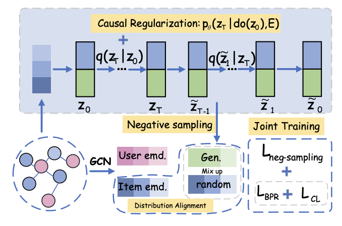

## Causal Negative Sampling via Diffusion Model for Out-of-Distribution Recommendation



In this paper, we propose a novel method named Causal
Negative Sampling via Diffusion (CNSDiff). By synthesizing nega-
tive samples in the latent space via a conditional diffusion process,
CNSDiff avoids the bias introduced by predefined candidate pools
and thus reduces the likelihood of generating FHNS. Moreover,
it incorporates a causal regularization term to explicitly mitigate
the influence of environmental confounders during the negative
sampling process, leading to robust negatives that promote out-
of-distribution (OOD) generalization. Comprehensive experiments
under four representative distribution shift scenarios demonstrate
that CNSDiff achieves an average improvement of 13.96% across all
evaluation metrics compared to state-of-the-art baselines, verifying
its effectiveness and robustness in OOD recommendation tasks.

****

## 📝 Environment

1. Create an environment named torch_gpu

```bash
conda create -n torch_gpu
```
2. Install packages from requirements.txt

```bash
pip install -r requirements.txt 
```
## 📈 Dataset
We conducted extensive experiments on the following three datasets. Detailed data processing procedures can be found in Appendix B of our paper.

| Dataset  | #Users | #Items | #Interactions |    Density |
| -------- | ------ | ------ | ------------- | ---------- |
| Food     |  7,809 |  6,309 |    216,407    | 4.4 × 10⁻³ |
| KuaiRec  |  7,175 | 10,611 |   1,153,797   | 1.5 × 10⁻³ |
| Yelp2018 |  8,090 | 13,878 |     398,216   | 3.5 × 10⁻³ |


## 🔬 Model Framework

```
CNSDiff/
├── README.md
├── main.py
├── SELFRec.py
├── requirements.txt
├── selfrec.jpg
├── base/
├── conf/
|   |____LightGCN.yaml
|   |____params.py
├── data/
├── dataset/
├── model/
├── module/
├── util/
├── log/
├── results/
```

## 🚀 Quick Reproduction
You can select datasets or modify other parameters in LightGCN.yaml under the config directory, and modify diffusion and negative sampling related parameters in params.py
```
python main.py 
```

## 🙏 Acknowledgments 
TODO